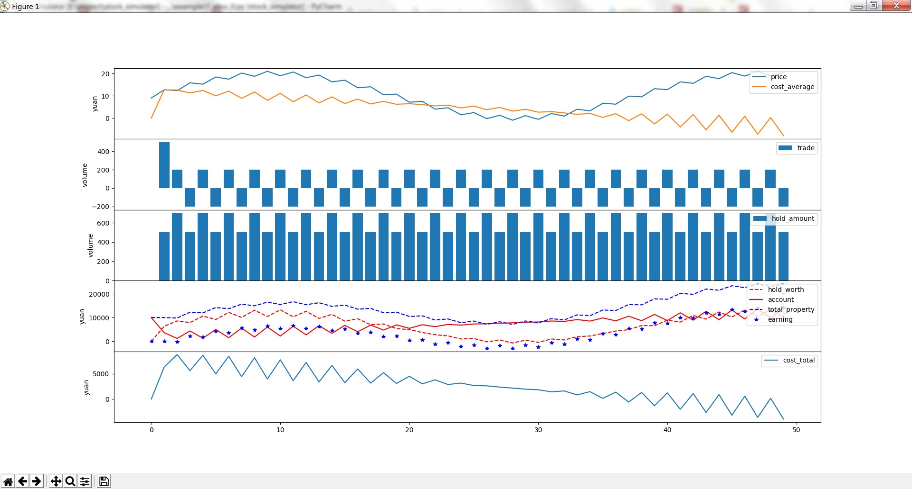

# 股票操作模拟器

通过输入自定义的股价变化规则还有买卖规则，自动计算相关数据的变化，例如收益变化、筹码成本变化等指标，并且以图像的形式表现出来，可以很清晰的展现出在股市中不同的操作会产生何种影响，让我们在实盘的时候有所启发

# how to use

## 实现`PriceSeries`

`PriceSeries`是一个抽象类，代表股价的变化规则

### 例如

以下例子假设股价大趋势是一个正弦图像，同时叠加了一系列的震荡

- get_price：获取当前价格
- get_duration：这段行情覆盖的时间长度

```python
class MyPriceSeries(sim.PriceSeries):

    def get_price(self, time):
        shock = 0
        if time % 2 == 0:
            shock = -1
        else:
            shock = 1
        return 10 + 10 * math.sin(time / 6) + shock

    def get_duration(self):
        return 50
```

## 实现`TradeSeries`

`TradeSeries`也是一个抽象类，代表买卖规则

### 例如

以下例子表示从1时刻开始建仓，然后配合上面的`MyPriceSeries`一直尝试高抛低吸的操作

- get_trade：获取交易数量，正数代表买入，负数代表卖出


```python
class MyTradeSeries(sim.TradeSeries):

    def get_trade(self, time):
        if time <= 1:  # 建仓
            return 500
        else:  # 频繁交易
            if time % 2 == 0:  # 高抛低吸
                return 200
            else:
                return -200
```

## 实例化`Simulator`

将自定义的股价变化规则和买卖规则传给`Simulator`，并设置账户初始额度

### 例如

初始账户余额为1w元

```python
s = sim.Simulator(MyPriceSeries(), MyTradeSeries(), account=10000)
```

## 开始模拟

```python
s.simulate()
```

效果如下图：


